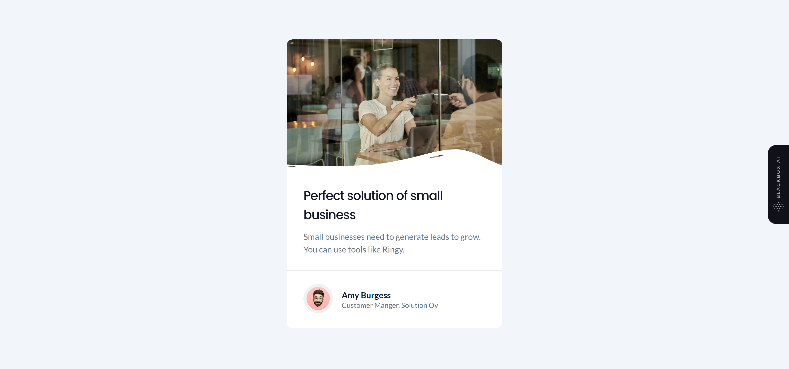

# Dev Challenges - Business Blog Card solution

This is a solution to the [Business Blog Card on DevChallenges.io](https://devchallenges.io/challenge/28).

## Table of contents

- [Dev Challenges - Business Blog Card solution](#dev-challenges---business-blog-card-solution)
  - [Table of contents](#table-of-contents)
  - [Overview](#overview)
    - [The challenge](#the-challenge)
    - [Screenshot](#screenshot)
    - [Links](#links)
  - [My process](#my-process)
    - [Built with](#built-with)
  - [Author](#author)

## Overview

### The challenge

Users should be able to:

- Create a card component that matches the given design.
- Use HTML to create the basic structure.
- Use CSS to style the card.

### Screenshot

### Links

- Solution URL: [https://github.com/ShrutiShinde418/DevChallenges2/tree/main/business-blog-card](https://github.com/ShrutiShinde418/DevChallenges2/tree/main/business-blog-card)
- Live Site URL: [https://business-blog-card-sigma.vercel.app/](https://business-blog-card-sigma.vercel.app/)

## My process

### Built with

- LESS

## Author

- GitHub - [@ShrutiShinde418](https://github.com/ShrutiShinde418)
- Frontend Mentor - [@ShrutiShinde418](https://www.frontendmentor.io/profile/ShrutiShinde418)
